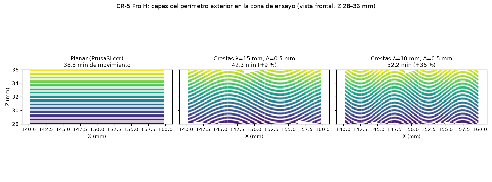

# NPS — Slicer no planar basado en PrusaSlicer

Slicer de capas **no planas** que usa PrusaSlicer como motor de corte, pensado para
dos objetivos:

- **Resistencia homogénea**: capas onduladas que encajan entre sí, de modo que la
  carga en Z ya no depende sólo de la adhesión entre capas planas.
- **Velocidad**: caudal volumétrico constante en todo el recorrido curvo y relleno
  impreso al caudal máximo del hotend.

## Cómo funciona

```
STL ──► deformación ──► PrusaSlicer (corte planar) ──► transformación inversa ──► G-code no planar
        z' = z - D          (perímetros, relleno,         z = z' + D, E·J,
                             retracciones…)                 F con caudal constante
```

1. **Deformar la malla.** Cada capa real es la superficie `z = s + D(x,y,z)` con
   `D = g(x,y) · ramp(z)`. La malla se subdivide (sin T-junctions) y se lleva al
   "espacio de corte" `z' = z - D`, donde esas superficies son planos.
2. **Cortar con PrusaSlicer.** Se corta la malla deformada con tu perfil de
   PrusaSlicer. Así se aprovecha todo su trabajo: perímetros, relleno, costuras,
   retracciones, refrigeración, etc.
3. **Transformar el G-code de vuelta.** Cada movimiento se trocea (`--seg-len`) y se
   devuelve al espacio real. La deformación es exactamente invertible, así que la
   geometría final coincide con el STL original.

### Física de la corrección de extrusión

El volumen entre dos capas sobre un área XY `A` es `A · h · J`, con
`J = dz/dz' = 1 / (1 − g · ramp'(z))`. Por eso:

- **Extrusión:** `E_real = E · J`. Las retracciones y los wipes no se escalan.
- **Velocidad:** `F_real = F · (L_3D / L_XY) / J`. Así el caudal volumétrico es el
  mismo que había decidido PrusaSlicer, y los cordones salen uniformes aunque la
  capa sea más gruesa o más fina.
- `--max-flow` y `--max-feed` limitan el resultado. `--fast-infill Q` imprime el
  relleno interno y sólido a `Q` mm³/s.

`D` sólo depende de `z` a través de la rampa, así que `J = 1` fuera de las zonas de
transición. Las capas onduladas mantienen un espesor constante y sólo cambian de
forma.

### Modos (`--mode`)

| modo | forma de capa | uso | impresora |
|---|---|---|---|
| `wave` (por defecto) | `A·sin(kx)·sin(ky)` (huevera) | resistencia homogénea entre capas, piezas anchas | 3 ejes, con pendiente ≤ `--max-slope` |
| `wave --wave-pattern ridges` | `A·sin(k·u)` (crestas) | paredes y probetas estrechas | 3 ejes |
| `conical` | cono `r·tan(θ)` | voladizos sin soportes | mejor en 4/5 ejes; en 3 ejes sólo con ángulos pequeños |
| `planar` | plano | referencia / depuración | cualquiera |

Antes de cortar, el programa comprueba dos cosas y se detiene si alguna falla
(`--force` para ignorarlo):

- que el espesor real de capa quede entre ×0.6 y ×1.4 del nominal (si no, alarga
  `--ramp`);
- que la pendiente de las capas no supere la que tolera tu boquilla
  (`--max-slope`, 20° por defecto), para evitar colisiones en impresoras de 3 ejes.

### Límites del eje Z (importante en impresoras de 3 ejes)

En una capa curva el eje Z se mueve todo el tiempo. Su velocidad es
`v_z = v_xy · pendiente` y su aceleración `a_z ≈ v_xy² · |z''|`. En máquinas con Z
por husillo (Creality y similares) son límites duros: si se superan, el firmware
frena el movimiento entero o el motor pierde pasos. Con `--z-max-speed` y
`--z-max-accel`, NPS reduce F tramo a tramo para respetarlos, y el tiempo
estimado ya lo incluye. **Ondas más largas y más bajas cuestan menos tiempo.**

## Uso

```bash
pip install -e .[dev]            # requiere PrusaSlicer (CLI) en el PATH o --prusa RUTA

# Exporta tu perfil desde PrusaSlicer: Archivo > Exportar > Exportar configuración
nps slice pieza.stl -o pieza.gcode -p mi_perfil.ini \
    --mode wave --amplitude 0.8 --wavelength 16 \
    --max-flow 20 --max-feed 200 --fast-infill 15
```

Opciones útiles: `--flat-top` (tapa superior plana), `--flat-below` (altura de las
capas planas iniciales), `--center X,Y` (centro de la cama) y `--workdir`
(conserva el STL deformado y el G-code planar intermedio para inspeccionarlos).

`nps/nps_overrides.ini` se carga después de tu perfil. Fuerza los ajustes que
la transformación necesita: sin arcos G2/G3, G-code de texto (no binario), E
relativo, sin modo vaso, sin torre de purga y con Z-hop.

## Creality CR-5 Pro H

`--printer cr5proh` carga `nps/profiles/cr5proh.ini`:

- cama de 300×225×380, boquilla de 0.4, Bowden con retracción de 5 mm;
- BL-Touch con `M420 S1`, para usar la malla guardada (cámbialo por `G29` si no la tienes);
- PLA a 205/60 °C, 100 mm/s como máximo, caudal de 10 mm³/s;
- límites de Z enviados con `M203 Z10` y `M201 Z250`, que NPS usa en su limitador;
- valores por defecto de la onda: 0.5 mm de amplitud y 20 mm de longitud.

```bash
nps slice pieza.stl -o pieza.gcode --printer cr5proh
nps slice pieza.stl -o pieza.gcode --printer cr5proh -p mi_filamento.ini   # tus ajustes encima
```

Compruébalo antes de imprimir. Los límites de firmware de tu máquina pueden ser
distintos: consúltalos con `M503`. Si subes los de Z (con `M203`/`M201` en el
G-code inicial), pasa los mismos valores a `--z-max-speed`/`--z-max-accel`.

### Prueba de resistencia en Z (G-code listo en `examples/cr5proh/`)

Probeta "hueso de perro" impresa en vertical: mordazas de 30 mm y zona de ensayo
de 20×5×30 mm, así que se rompe entre capas. Se genera con
`examples/make_test_models.py` → `probeta_traccion_z.stl`.

| fichero | capas | tiempo de movimiento estimado |
|---|---|---|
| `probeta_planar.gcode` | planas (referencia) | 38.8 min |
| `probeta_crestas_l15.gcode` | crestas λ=15 mm, A=0.5 mm | 42.3 min (+9 %) |
| `probeta_crestas_l10.gcode` | crestas λ=10 mm, A=0.5 mm | 52.2 min (+35 %) |



Protocolo sugerido:

1. Imprime primero un cubo (`--printer cr5proh`) y vigila la primera capa
   ondulada a ~5 mm de altura: no debe haber roces ni saltos de Z.
2. Imprime al menos 3 probetas de cada tipo con el mismo filamento y el mismo día.
3. Tracciona en Z (máquina de ensayos o un montaje con cubo y báscula colgante)
   y anota la carga de rotura y dónde rompe.
4. Las crestas ganan si rompen con más carga **y** la grieta sigue la onda en vez
   de un plano limpio.

### Resultados de referencia (PrusaSlicer 2.7.2, perfil por defecto, sin límites de Z)

| modelo | J (rango de espesor) | tiempo de movimiento planar → NPS (`--fast-infill 15`) |
|---|---|---|
| cubo 20 mm | 0.81 – 1.32 | 12.6 → 10.0 min |
| probeta vertical 10×4×60 | 0.87 – 1.18 | 21.0 → 16.7 min |

Los tiempos son estimaciones cinemáticas que no tienen en cuenta las
aceleraciones. Los modelos de prueba se generan con
`PYTHONPATH=. python examples/make_test_models.py`.

## Estado y hoja de ruta

Esto es la **fase 1**: un pipeline en Python sobre la CLI de PrusaSlicer. Funciona con
2.7–2.9 y debería funcionar con 3.0 (ahora en alpha) sin cambios, porque sólo
depende de la CLI y del G-code de texto. Ver [docs/arquitectura.md](docs/arquitectura.md).

- [ ] Validación física: ensayos de tracción en Z, planar frente a `wave`
      (probeta vertical incluida).
- [ ] Campos guiados por tensiones (FEA) en lugar de una onda fija.
- [ ] Tapa superior que siga la superficie del modelo (acabado no planar real).
- [ ] Detección de colisiones con la geometría real del cabezal (no sólo la pendiente).
- [ ] Desfase de fase entre capas alternas (entrelazado tipo "brick layers").
- [ ] Fase 2: integrar la deformación en el núcleo C++ de PrusaSlicer (`libslic3r`)
      como etapa de *slicing* y *G-code export*, con vista previa en la GUI.

## Tests

```bash
pytest          # el test de extremo a extremo se omite si no hay PrusaSlicer
```
